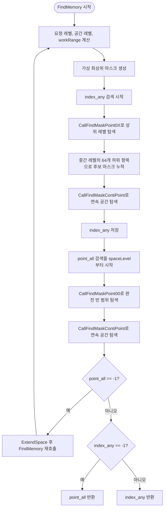

# `FindMemory` 동작 정리

대상 함수: [`main.c`](main.c)의 `FindMemory`

## 역할

`FindMemory(AS, arg_size)`는 `AS->ptr`의 계층형 비트맵을 검색해 요청 크기만큼 연속된 빈 위치의 인덱스를 찾습니다. 현재 구현은 후보를 두 경로로 계산합니다.

- `index_any`: `all` 비트 기준으로 완전히 사용된 상태가 아닌 범위를 따라 내려가며 찾은 후보
- `point_all`: 완전히 비어 있는 범위를 대상으로 찾은 후보

두 후보를 계산하는 순서는 `index_any` 검색 후 `point_all` 검색입니다. 두 검색은 같은 `workMask`로 시작하지만, 서로 다른 `point_*` 변수와 레벨 진행 상태를 사용합니다.

## 보조 함수의 의미

- `all`: 해당 범위가 전부 사용 중임을 나타내는 비트맵
- `any`: 해당 범위에 사용 중인 부분이 있음을 나타내는 비트맵
- `~all & ~any`: 비어 있는 범위로 볼 수 있는 비트 위치
- `toContiBit(mask, size)`: `mask`에서 `size`개 이상 연속된 1을 만족하는 시작 위치들을 남김
- `ofLeftBit(mask)`: 가장 낮은 비트 번호의 1 위치를 반환함. 입력이 0이면 `-1`을 반환함
- `CallFindMaskPoint0X`: 현재 레벨의 `~all`에서 하위 후보를 선택함
- `CallFindMaskPoint00`: 현재 레벨의 `~all & ~any`에서 하위 후보를 선택함
- `CallFindMaskContiPoint`: `~all & ~any`에 `toContiBit`를 적용해 연속 공간 후보를 선택함

## 검색 단계

### 1. 검색 기준 준비

`currentLevel`은 `ofLevel(arg_size)`, `spaceLevel`은 `ofLevel(AS->ptr_size)`입니다. `workRange`는 현재 요청 크기를 `currentLevel` 단위로 환산한 범위입니다. `createVirtualTopMask(AS)`로 가상 최상위 마스크를 만들고, 각 검색 경로는 `ofLeftBit(~workMask.all)`에서 시작합니다.

현재 함수에서 `workMask.any`는 디버그 출력에만 사용됩니다. 후보 시작점은 두 경로 모두 `workMask.all`만으로 계산합니다.

### 2. `index_any` 경로

1. `point_any`를 가상 최상위 마스크에서 초기화합니다.
2. 요청 레벨보다 충분히 높은 레벨은 `CallFindMaskPoint0X`로 내려갑니다. 후보가 `-1`이면 이 구간에서는 더 내려가지 않습니다.
3. 중간 레벨에서는 64개 하위 항목을 각각 검사해 하나의 64비트 후보 `mask`를 만듭니다. `mask`를 반복문 초기식에서 선언한 것은 이 64개 검사 결과를 모으기 위해서입니다. 현재 사용 전제에서는 바깥 레벨 반복도 한 번 실행되므로, 다음 레벨까지 `mask`를 누적하는 동작은 탐색 의미에 포함되지 않습니다.
4. 남은 레벨은 `CallFindMaskContiPoint`로 내려가며 요청 크기의 연속 빈 공간을 찾습니다.
5. 최종 `point_any`를 `index_any`로 보관합니다.

### 3. `point_all` 경로

1. `workLevel`을 `spaceLevel`로 되돌리고 `point_all`을 가상 최상위 마스크에서 초기화합니다.
2. 요청 레벨보다 한 단계 위까지 `CallFindMaskPoint00`으로 완전히 비어 있는 하위 후보를 선택합니다. 후보가 `-1`이면 이 구간에서는 값을 유지합니다.
3. 남은 레벨은 `CallFindMaskContiPoint`로 내려가며 연속 빈 공간을 찾습니다.

이 경로에는 `CallFindMaskPoint00` 반복 결과를 `CallFindMaskContiPoint(..., 0, ...)`로 덮어쓰는 대입이 없습니다. `CallFindMaskContiPoint`는 현재 계산된 `point_all`을 이어받습니다.

## 최종 선택과 확장

```c
INT return_index = (index_any == -1 ? point_all : index_any);
if (point_all == -1) ExtendSpace(AS);
return point_all == -1 ? FindMemory(AS, arg_size) : return_index;
```

- `point_all`을 찾지 못하면 공간을 확장한 뒤 함수를 재호출합니다. 이 조건은 `index_any`의 성공 여부와 별개로 적용됩니다.
- `point_all`을 찾았으면 `index_any`가 유효한 경우 `index_any`를 우선 반환합니다.
- `index_any`가 `-1`이면 `point_all`을 반환합니다.

`INT`는 `uint64_t` 별칭이므로 `ofLeftBit`의 `-1`은 `INT`에 저장될 때 `UINT64_MAX` 값이 됩니다. 기존 비교식의 `== -1`은 이 unsigned 변환을 이용한 실패 판정입니다.

## 플로우 차트



## 현재 구현의 주의점

- `spaceSize`는 계산되지만 함수에서 사용되지 않습니다.
- `workMask.any`는 현재 디버그 출력 외의 탐색 결정에는 사용되지 않습니다.
- 상위 레벨 탐색에서 후보가 `-1`이 되더라도, 남은 레벨이 있으면 뒤의 `CallFindMaskContiPoint` 반복은 계속 실행됩니다. 실패값을 해당 반복에서 조기 반환하지 않으므로, sentinel을 이용한 인덱스 계산이 유효한지 점검이 필요합니다.
- `arg_size == 0` 등 잘못된 요청 크기와 `ofLevel` 입력 경계에 대한 검증은 함수 안에 없습니다. 양수이며 표현 가능한 크기가 전달된다는 전제가 있습니다.

## 시인성 개선 제안

아래 항목은 탐색 결과를 바꾸려는 제안이 아니라, 함수의 의도와 각 단계의 역할을 코드에서 더 빨리 파악하기 위한 제안입니다.

1. **역할이 드러나는 변수명 사용**
    - `currentLevel` → `requestLevel`
    - `workLevel` → `level`
    - `workRange` → `requestSpan` 또는 `rangeAtRequestLevel`
    - `point_any`, `index_any`, `point_all`은 각각 어떤 후보인지 이름에 드러내기

2. **루프를 여러 줄로 펼치기**
    현재는 초기화, 반복 조건, 레벨 감소, 본문이 한 줄에 몰린 루프가 있습니다. 중괄호와 줄바꿈을 사용하면 단계별로 값이 어떻게 바뀌는지 따라가기 쉽습니다. 특히 64개 하위 항목을 살피는 내부 루프는 “후보 비트 설정”을 별도 줄로 분리하면 좋습니다.

3. **비트 연산과 시프트의 괄호를 명시하기**
    `workRange` 계산이나 `point_any << 6`처럼 시프트와 산술 연산이 섞인 식은 의도한 그룹을 괄호로 표시하면 C 연산자 우선순위에 익숙하지 않아도 읽기 쉽습니다.

4. **실패 sentinel에 이름 붙이기**
    `-1`과의 비교가 반복되므로 `NO_INDEX`처럼 의미가 드러나는 상수를 두면 실패 판정과 일반 인덱스 계산을 구분하기 쉽습니다. `INT`가 unsigned 형식인 점을 고려해 상수의 표현도 한 가지 방식으로 통일합니다.

5. **탐색 단계마다 짧은 주석 추가하기**
    `any` 후보 검색, 64개 하위 후보 조사, 완전히 빈 범위 검색, 확장 후 재시도처럼 목적이 바뀌는 지점에 설명을 두면 `point_any`와 `point_all` 계산이 서로 다른 이유가 선명해집니다.

6. **디버그 출력과 탐색 로직 분리하기**
    현재 함수 안의 `printf`는 탐색 흐름 사이에 섞여 있고, 호출할 때마다 출력됩니다. 필요할 때만 활성화되는 디버그 매크로나 별도 로그 함수로 모으면 핵심 제어 흐름이 잘 보입니다.

7. **사용하지 않는 계산과 오래된 주석 정리하기**
    `spaceSize`처럼 사용되지 않는 값과 현재 동작을 설명하지 않는 주석 코드는 독자가 실행 경로로 오해할 수 있습니다. 제거하거나, 보존할 필요가 있다면 목적을 명시합니다.
